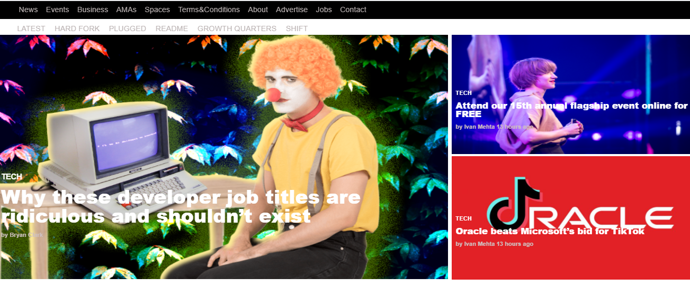

# TNW-Website-Clone
This project consists of replicating the The Next Web website putting emphasis on how it behaves differently depending on the size of the screen where the website is rendered.

​
## Project Requirements

- Align all elements with float and flex or grid.
- Use a mobile first approach when dealing with mediaqueries with 2 breakpoints (you should figure out the exact width for each breakpoint by yourself).
- Remember to double-check if you page layout does not brake on smaller screens.

​
## Built With

- HTML
- CSS
​
## Live Demo
[Live Demo Link]( https://delicelydia.github.io/TNW-Website-Clone/index.html
)
​
## Authors
- Github: [@DeliceLydia](https://github.com/DeliceLydia)
- Twitter: [@IngabireLydia3](https://twitter.com/IngabireLydia)
- Linkedin: [Delice Lydia](https://www.linkedin.com/in/delice-lydia-91b55b167/)

​
## Show your support
​
Give a ⭐️ if you like this project!
